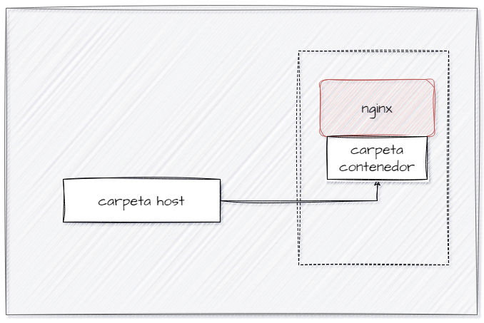

# BIND MOUNT
En un bind mount mapeamos (montar) un directorio o archivo específico del sistema de archivos del host con una parte del sistema de ficheros del contenedor.

```
docker run -d --name <nombre contenedor> -v <ruta carpeta host>:<ruta carpeta contenedor> <imagen> 
```
ó
```
docker run -d --name <nombre contenedor> --mount type=bind,source=<ruta carpeta host>,target=<ruta carpeta contenedor> <imagen>
```
- destination, dst, target: La ruta donde se monta el archivo o directorio en el contenedor.
- source, src: El origen del montaje.
  
### En tu computador crear una carpeta llamada nginx y dentro de esta carpeta crea otra llamada html. Como se aprecia en la figura.


### Crear un contenedor con la imagen nginx:alpine, mapear todos por puertos, para la ruta carpeta host colocar el directorio en donde se encuentra la carpeta html en tu computador y para la ruta carpeta contenedor: /usr/share/nginx/html (esta ruta se obtiene al revisar la documentación de la imagen)

# COMPLETAR CON EL COMANDO


### ¿Qué sucede al ingresar al servidor de nginx?
El servidor está abajo.
# COMPLETAR CON LA RESPUESTA A LA PREGUNTA


### ¿Qué pasa con el archivo index.html del contenedor?
No se encuentra ya que mapeamos una carpeta vacía.
# COMPLETAR CON LA RESPUESTA A LA PREGUNTA


### Ir a https://html5up.net/ y descargar un template gratuito, descomprirlo dentro de tu computador en la carpeta html
### ¿Qué sucede al ingresar al servidor de nginx?
El servidor nginx esta arriba con la plantilla HTML5.
# COMPLETAR CON LA RESPUESTA A LA PREGUNTA


### Eliminar el contenedor
# COMPLETAR CON EL COMANDO


### ¿Qué sucede al crear nuevamente un contenedor montado al directorio definidos anteriormente?
Sigue levantandose el servidor ya que los archivos se encuentran en el computador.
# COMPLETAR CON LA RESPUESTA A LA PREGUNTA


