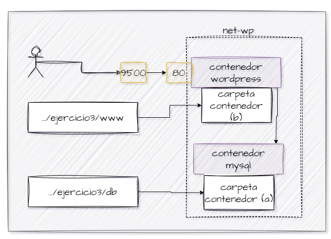

## Esquema para el ejercicio

### Crear red net-wp
# COMPLETAR CON EL COMANDO 
docker network create net-wp

### Para que persista la información es necesario conocer en dónde mysql almacena la información.
# COMPLETAR LA SIGUIENTE ORACIÓN. REVISAR LA DOCUMENTACIÓN DE LA IMAGEN EN https://hub.docker.com/
En el esquema del ejercicio carpeta del contenedor (a) es /var/lib/mysql

Ruta carpeta host: .../ejercicio3/db

### ¿Qué contiene la carpeta db del host?
Esta vacía
# COMPLETAR CON LA RESPUESTA A LA PREGUNTA

### Crear un contenedor con la imagen mysql:8  en la red net-wp, configurar las variables de entorno: MYSQL_ROOT_PASSWORD, MYSQL_DATABASE, MYSQL_USER y MYSQL_PASSWORD
# COMPLETAR CON EL COMANDO
docker run -d --name srv-mysql -v C:\Users\emiau\Downloads\nginx\ejercicio3\db:/var/lib/mysql -e MYSQL_ROOT_PASSWORD=emiau123 -e MYSQL_USER=emiau -e MYSQL_PASSWORD=emiau123 -e MYSQL_DATABASE=db_wordpress mysql:8

### ¿Qué observa en la carpeta db que se encontraba inicialmente vacía?
# COMPLETAR CON LA RESPUESTA A LA PREGUNTA

### Para que persista la información es necesario conocer en dónde wordpress almacena la información.
# COMPLETAR LA SIGUIENTE ORACIÓN. REVISAR LA DOCUMENTACIÓN DE LA IMAGEN EN https://hub.docker.com/
En el esquema del ejercicio la carpeta del contenedor (b) es /var/www/html

Ruta carpeta host: .../ejercicio3/www

### Crear un contenedor con la imagen wordpress en la red net-wp, configurar las variables de entorno WORDPRESS_DB_HOST, WORDPRESS_DB_USER, WORDPRESS_DB_PASSWORD y WORDPRESS_DB_NAME (los valores de estas variables corresponden a los del contenedor creado previamente)
# COMPLETAR CON EL COMANDO
docker run -d --name srv-wordpress -p 9500:80 --link srv-mysql:mysql_db -e WORDPRESS_DB_HOST=mysql_db -e WORDPRESS_DB_USER=root -e WORDPRESS_DB_PASSWORD=emiau123 -e WORDPRESS_DB_NAME=db_wordpress -v C:\Users\emiau\Downloads\ejercicio3\www:/var/www/html wordpress

### Personalizar la apariencia de wordpress y agregar una entrada

### Eliminar el contenedor y crearlo nuevamente, ¿qué ha sucedido?
Sigue la pagian configurada he intacta.
# COMPLETAR CON LA RESPUESTA A LA PREGUNTA 

